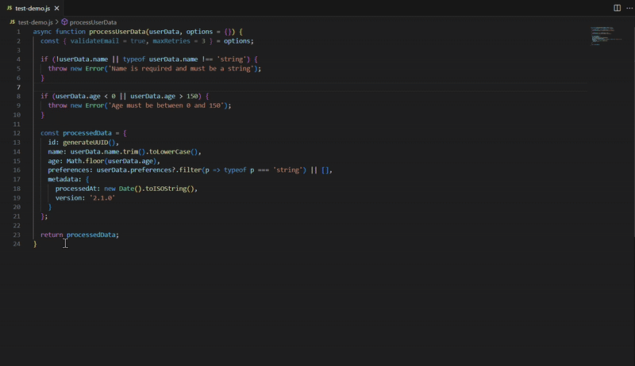

# vscode-docgen

[](https://marketplace.visualstudio.com/items?itemName=YOUR_PUBLISHER_ID.vscode-docgen)
[](https://github.com/YOUR_USERNAME/vscode-docgen)
[](https://github.com/YOUR_USERNAME/vscode-docgen)
[](LICENSE)

> **AI-Powered JSDoc Generation for VS Code**  
> Transform your code documentation with intelligent AI assistance

<div align="center">
  
  <h2>🚀 AI-Powered JSDoc Generation</h2>
  <p><em>Generate professional JSDoc comments instantly with OpenAI GPT</em></p>
</div>

---

## 📖 Overview

`vscode-docgen` is a powerful VS Code extension that automatically generates comprehensive JSDoc comments for your JavaScript and TypeScript functions using OpenAI's GPT model. Simply select any function, run the command, and watch as AI creates professional documentation with proper parameter types, return values, and detailed descriptions.

### 🎯 **Why vscode-docgen?**

- **⚡ Lightning Fast** - Generate documentation in seconds, not minutes
- **🤖 AI-Powered** - Leverages OpenAI GPT for intelligent analysis
- **🎯 Zero Configuration** - Works out of the box with just your API key
- **📝 Professional Quality** - Generates industry-standard JSDoc comments
- **🛡️ Type Safe** - Supports both JavaScript and TypeScript

---

## ✨ Features

| Feature | Description |
|---------|-------------|
| 🎯 **One-Click Generation** | Select any function and generate JSDoc instantly |
| 🔧 **Multi-Language Support** | Works seamlessly with JavaScript & TypeScript |
| 📊 **Smart Analysis** | AI understands complex function signatures and logic |
| 🎨 **Professional Formatting** | Generates properly structured JSDoc with appropriate tags |
| ⚡ **Progress Tracking** | Visual feedback during generation process |
| 🛡️ **Error Handling** | Clear error messages and graceful failure handling |
| 🔒 **Privacy Focused** | Only sends selected code to OpenAI, no data storage |

---

## 📋 Prerequisites

Before you begin, ensure you have the following:

- **VS Code** ≥1.60.0
- **Node.js** ≥14.0.0  
- **OpenAI API Key** ([Get one here](https://platform.openai.com/api-keys))

---

## 🚀 Quick Start

### **Step 1: Install from Source**

```bash
# Clone the repository
git clone https://github.com/YOUR_USERNAME/vscode-docgen.git

# Navigate to project directory
cd vscode-docgen

# Install dependencies
npm install

# Compile the extension
npm run compile

# Open in VS Code
code .
```

### **Step 2: Package & Install Extension**

```bash
# Install vsce globally
npm install -g vsce

# Package the extension
vsce package

# Install the extension
code --install-extension vscode-docgen-1.0.1.vsix
```

### **Step 3: Configure API Key**

1. **Get your OpenAI API key** from [OpenAI Platform](https://platform.openai.com/api-keys)
2. **Open VS Code Settings** (`Ctrl+,` or `Cmd+,` on Mac)
3. **Search for "JSDoc Generator"**
4. **Set `docgen.openaiApiKey`** to your API key (starts with `sk-`)

---

## 📖 Usage Guide

### **Basic Usage**

1. **Open a JavaScript/TypeScript file**
2. **Select a function, class, or method**
3. **Press `Ctrl+Shift+P`** (or `Cmd+Shift+P` on Mac)
4. **Type "Generate JSDoc"** and select the command
5. **Watch the magic happen!** ✨

### **Advanced Usage**

The extension works with any JavaScript or TypeScript code:

- **Functions** - Regular, async, arrow functions
- **Classes** - Class methods and constructors  
- **Methods** - Object methods and class methods
- **Complex Signatures** - Destructuring, optional parameters, rest parameters

---

## 💡 Live Example

### **Before: Plain Function**
```javascript
function calculateTotal(items, taxRate) {
  const subtotal = items.reduce((sum, item) => sum + item.price, 0);
  return subtotal * (1 + taxRate);
}
```

### **After: Professional JSDoc**
```javascript
/**
 * Calculates the total price including tax for a list of items
 * @param {Array<{price: number}>} items - Array of items with price property
 * @param {number} taxRate - Tax rate as a decimal (e.g., 0.08 for 8%)
 * @returns {number} The total price including tax
 */
function calculateTotal(items, taxRate) {
  const subtotal = items.reduce((sum, item) => sum + item.price, 0);
  return subtotal * (1 + taxRate);
}
```

---

## 🎬 Demo



*Select code → Generate JSDoc → Get professional documentation*

---

## 🧪 Testing

Run the comprehensive test suite:

```bash
npm test
```

### **Test Coverage**

The project includes smoke tests that verify:
- ✅ Command registration
- ✅ Extension activation  
- ✅ Basic functionality coverage
- ✅ Error handling scenarios

Test coverage reports are generated automatically with detailed metrics.

---

## 🔧 Configuration

### **Extension Settings**

| Setting | Type | Default | Description |
|---------|------|---------|-------------|
| `docgen.openaiApiKey` | `string` | `""` | Your OpenAI API key |
| `docgen.openai.model` | `string` | `gpt-3.5-turbo` | OpenAI model to use |

### **Available Commands**

| Command | Description |
|---------|-------------|
| `Generate JSDoc` | Generate JSDoc for selected code |

---

## 📝 Changelog

See [CHANGELOG.md](CHANGELOG.md) for detailed version history and updates.

---

## ⚖️ License

This is a solo-showcase project demonstrating advanced VS Code extension development with AI integration. No external license is provided.

---

## 🤝 Contributing

This is a personal showcase project. For questions or feedback, please open an issue on GitHub.

---

<div align="center">
  <p><strong>Made with ❤️ for the developer community</strong></p>
  <p><em>Empowering developers to write better documentation, one function at a time.</em></p>
</div>